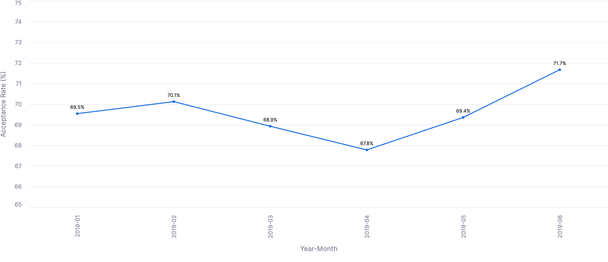

# Deel Analytics Engineering Challenge — Globepay Card Payments

## 1. Business context

Deel clients add funds to their Deel account using debit/credit cards. These transactions are processed through
external processor Globepay. Transaction & card details are passed along to Globepay via their API. Globepay returns the outcome
of the transaction (accept/declined) and separately a chargeback raised against past data.


The ask is to create a model starting from the raw data and api specs provided.


## 2. Preliminary data exploration

| File | Rows | Grain | Key fields |
|---|---|---|---|
| `acceptance_transactions.csv` | 5,430 | 1 row per payment attempt | `external_ref` (PK), `state` (ACCEPTED/DECLINED), `amount`, `currency`, `country`, `rates` (JSON of FX→USD), `cvv_provided`, `date_time` |
| `chargeback_report.csv` | 5,430 | 1 row per transaction | `external_ref` (PK), `chargeback` (boolean) |


Findings from profiling the raw data:

- **`external_ref` ** Is the unique key in both raw files. Assumed to be the PK and join
in both tables. 
- **Every transaction has a matching chargeback record** (5,430/5,430)
  All transactions have a chargeback entry also. This may not be the case in production as chargeback might arrive later.
  Join between the two sets would be based on this fact.
- **`status` ** Both datasets have this column. There is no information about what exactly it means. Good to preserve as is.
- **`rates` is a JSON map of currency to rate-to-USD**, Conversion rates at the time of transaction for the currency against USD.
This means, amount conversion would be `amount/conversion rate`
- **Card country codes** in the data: `AE, CA, FR, MX, UK, US`. 
- **Date range**: 2019-01-01 through 2019-06-30 
- **One negative `amount`** was found. Not sure about the cause. Likely an anomoly coming from a typo or a defect in the system.
- `transaction_status` values are exactly `{ACCEPTED, DECLINED}` — no other
  states observed. Assumed as the only two.

## 3. Repo structure

```
deel_dbt/
├── seeds/                          raw source files, loaded as-is
│   ├── acceptance_transactions.csv     Globepay payment attempts
│   ├── chargeback_report.csv           Globepay chargeback outcomes
│   └── countries.csv                   This is a file created using the combination of country code and currency and enriching with country name.
├── models/
│   ├── staging/                    1:1 with sources, columns renamed. Built as view
│   ├── intermediate/               two staging models with rates normalized as a separate column. 
│   └── marts/                      analyst-facing star schema
├── macros/
│   ├── get_fx_rate_to_usd.sql       pulls a currency's rate out of the raw JSON rate map
│   └── get_custom_schema.sql        flattens custom schema naming (dbt convention override)
└── packages.yml                    dbt_utils (date_spine, expression tests)
```


## 4. Model architecture

Standard dbt layering — staging → intermediate → marts 

```
seeds                    staging                intermediate                    marts
──────────────────────────────────────────────────────────────────────────────────────────────
acceptance_transactions ─▶ stg_acceptance ──┐
                                             ├─▶ int_acceptance_chargeback ─▶ fct_acceptance_transactions
chargeback_report ───────▶ stg_chargeback ──┘                                        │
                                                                                       │
countries ───────────────▶ stg_country ──▶ dim_country ────────────────────────────────┤
                                                                                       │
                            dim_calendar (date spine, no source) ─────────────────────┘
```


- **`stg_acceptance` / `stg_chargeback`** — These are unfiltered views built on the raw sources.
Columns renamed for clarity.
- **`int_acceptance_chargeback`** — left-joins chargeback onto acceptance, as transactions may not have chargebacks.
Resolves the currency exchange rate from json map using `get_fx_rate_to_usd` macro. Also flags anomoly amount as `transaction_anomoly`.
 
- **`dim_country`** — thin pass-through of the `countries` seed, which is user created.
- **`dim_calendar`** — `dbt_utils.date_spine`-generated day grain with common
  grouping columns (month, quarter, ISO week, year-month/quarter/week keys).
- **`fct_acceptance_transactions`** — Fact table capturing the transaction. One row per
  transaction; card country/currency codes are resolved to `dim_country.country_id`, 
  and `transaction_date_key` is added as an explicit FK into `dim_calendar`. Materialized as a table (staging/intermediate
  are views) for better query performance.


## 5. Macros, validation, documentation — notes for future contributors

- **Macros**: `get_fx_rate_to_usd(fx_rates_to_usd, currency)` adding the logic to pull the exchange rate for a currency from JSON into reusable macro.
- **Data validation**: tests are split by confidence —
  - `unique` / `not_null` on every primary and foreign key (`transaction_id`,
    `country_id`, `transaction_date_key`) at `error` severity, since a
    violation there silently breaks joins downstream.
  - `accepted_values` on `transaction_status` and a non-negative check on
    `transaction_amount` are set to `warn`, because it is based on assumptions about amount and the status values.
  - Potentially, a test guarding against more than one chargeback row per transaction can be created.
- **Documentation**: every model and column has a `description:` in its
  `models.yaml`, with assumptions about the data.  Keeping this up-to-date is a good practice;
   `dbt docs generate`  and `dbt docs serve` can be used to create a data catalog.

## 6. Part 2 — answering the analyst's questions

All questions can be answered by querying the mart tables.

### Q1 — Acceptance rate over time

```sql
select
    c.year_month,
    count_if(f.transaction_status = 'ACCEPTED')        as accepted_transactions,
    count(*)                                            as total_transactions,
    ((accepted_transactions / total_transactions) * 100)::decimal(5,2)  as acceptance_rate
from deel.marts.fct_acceptance_transactions f
join deel.marts.dim_calendar c 
    on f.transaction_date_key = c.date_day
group by 1
order by 1;
```

Swap `c.year_month` for `c.date_day`, `c.year_week_number`, or `c.year_quarter`
depending on the granularity necessary. More columns derived from the date can be added to `dim_calendar` for aggregating.

**Result on current data**: It hovers around a tight band between 67 to 72 percent.

| Month | Accepted / Total | Rate |
|---|---|---|
| 2019-01 | 647 / 930 | 69.57% |
| 2019-02 | 589 / 840 | 70.12% |
| 2019-03 | 641 / 930 | 68.92% |
| 2019-04 | 610 / 900 | 67.78% |
| 2019-05 | 645 / 930 | 69.35% |
| 2019-06 | 645 / 900 | 71.67% |




### Q2 — Countries where declined transactions exceeded $25M

```sql
With decline_check as 
    (select dc.country_id, dc.country_code, dc.country_name, sum(transaction_amount_usd) as total_amount, SUM(IFF(transaction_status = 'DECLINED', transaction_amount_usd, 0)) as declined_amount,
     (SUM(IFF(transaction_status = 'DECLINED', transaction_amount_usd, 0))/1000000) declined_millions
    from deel.marts.fct_acceptance_transactions t join deel.marts.dim_country dc on t.COUNTRY_ID = dc.country_id
    where not transaction_anomoly
    group by 1,2,3
    having SUM(IFF(transaction_status = 'DECLINED', transaction_amount_usd, 0)) >= 25000000)

SELECT country_code, country_name, declined_millions::decimal(5,2) as "Declined amount (USD)"
from decline_check
    ;
```

**Result on current data**: 4 countries clear the $25M threshold —

| Country_Code | Country | Declined amount (USD) |
|---|---|
| FR | France | $32.6M |
| UK | United Kingdom | $27.5M |
| AE | United Arab Emirates | $26.3M |
| US | United States | $25.1M |


### Q3 — Transactions missing chargeback data

```sql
    select * 
    from deel.intermediate.int_acceptance_chargeback 
    where is_chargeback is null ;
```

`is_chargeback` is `null` in `int_acceptance_chargeback` when a transaction in `stg_acceptance` doesn't have a corresponding entry in `stg_chargeback`

## 7 Snowflake Setup

For the dbt project to run. Following are needed.

1. A database named deel
2. A role called DEEL_READ_WRITE with permissions to create objects in deel database
3. A warehouse called DBT_WORKLOAD
4. A user with access to DEEL_READ_WRITE role.

There a script at `snowflake\db_user_setup.sql` to set this up on snowflake. profiles.yml in the repo can be used if the script is followed by setting the environment variables for `DEEL_SNOWFLAKE_ACCOUNT` and `DEEL_SNOWFLAKE_PAT` in the venv where the dbt is being run from.

## 8. Running the project

```bash
dbt deps      # install dbt_utils
dbt seed      # load the three raw CSVs
dbt run       # build staging → intermediate → marts
dbt test      # run schema + data tests
dbt docs generate && dbt docs serve   # browse lineage graph + docs
```
